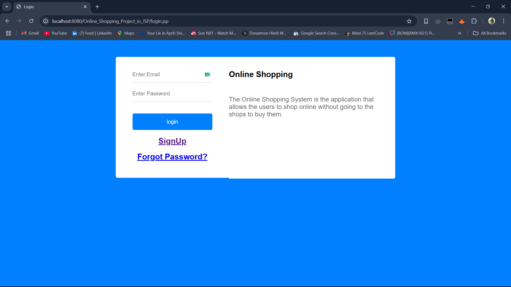
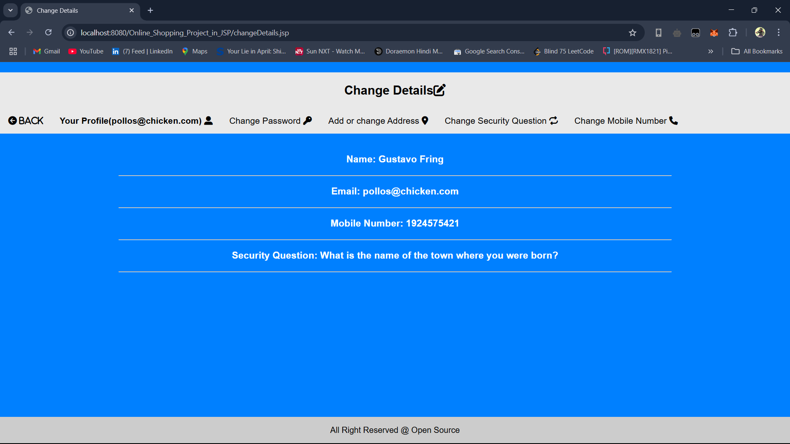
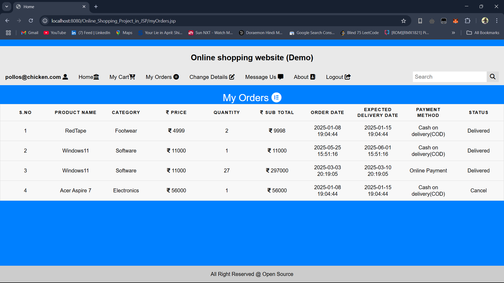
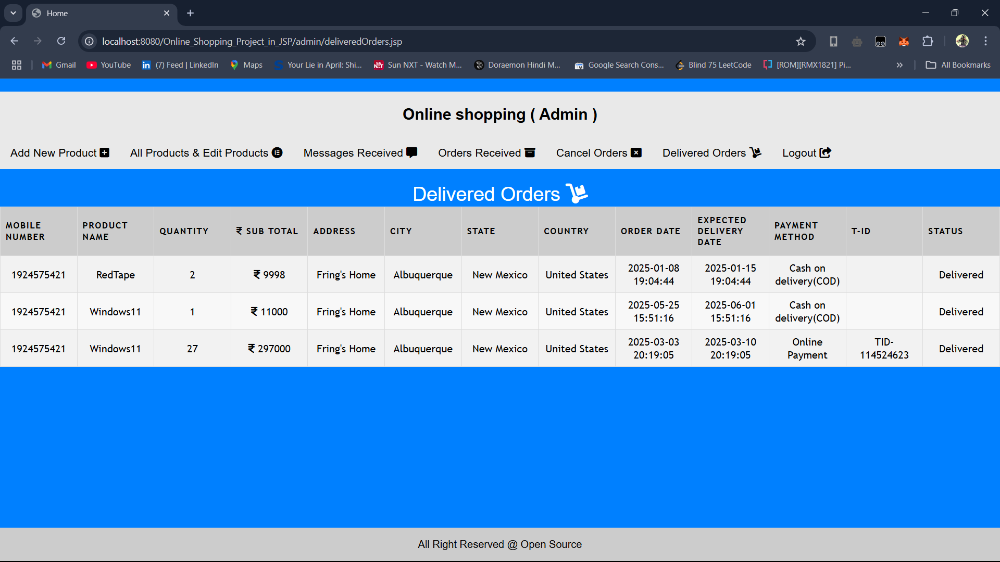
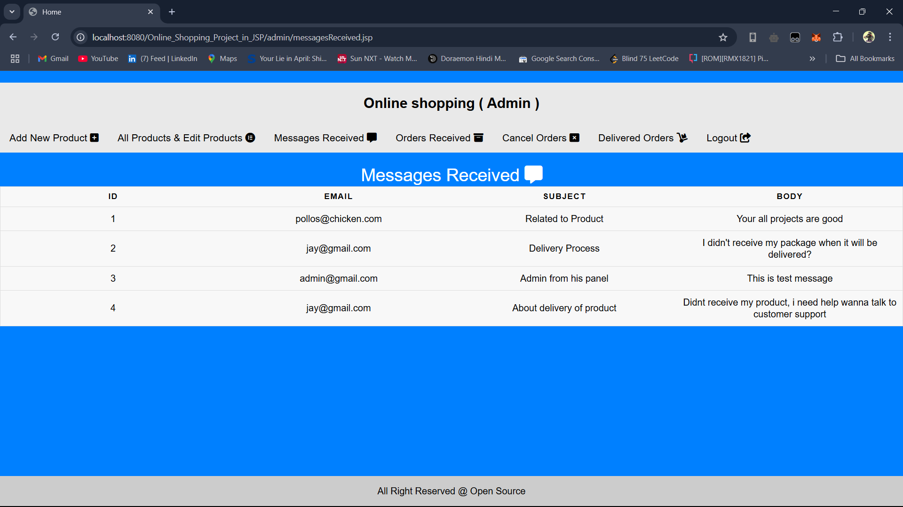

# 🛒 Online Shopping Project (JSP + JDBC + MySQL)

## 📖 Project Overview

The **Online Shopping Project** is a web-based application developed using **Java (JSP)** and **MySQL** that allows users to browse products, add items to their cart, and place orders online. Admin users can manage products, categories, and view customer orders.

This project demonstrates basic concepts of **web development using Java EE**, including:
- JSP for UI rendering and backend logic
- JDBC for database connectivity
- MySQL to store data

---

## 🚀 Features

- 🧍 User Registration & Login  
- 🛍️ Product Catalog with Category Filtering  
- 🛒 Add to Cart Functionality  
- 📦 Order Placement and Order History  
- 🔐 Admin Panel for Managing Products  
- 💾 MySQL Database Integration

---

## 🛠️ Project Setup (Eclipse IDE)

### 1. **Create Dynamic Web Project**
1. Open **Eclipse IDE**.
2. Go to `File > New > Dynamic Web Project`.
3. Enter the following:
   - **Project Name**: `OnlineShoppingProject`
   - **Target Runtime**: `Apache Tomcat v11.0.0-M22`
   - **Dynamic Web Module Version**: `5.0 or higher`
4. Click **Finish**.

---

### 2. **Add MySQL JDBC Connector**

1. Download the MySQL JDBC driver (Connector/J) from:  
   [https://dev.mysql.com/downloads/connector/j/](https://dev.mysql.com/downloads/connector/j/)
2. Copy the JAR file (e.g., `mysql-connector-java-8.0.xx.jar`) to:
   ```
   src/main/webapp/WEB-INF/lib/
   ```

---

### 3. **Setup JDBC Database Connection**

1. Create a new Java class for database connection:
   ```
   src/main/java/com/yourpackage/
   ```
2. Create `DB.java`
3. Change MySQL credentials
---

### 4. **Create Database Tables**

1. Create a folder for table setup scripts:
   ```
   src/main/webapp/table/
   ```
2. Create `create_table.jsp`
3. Run file

---

## 📁 Project Structure

```
OnlineShoppingProject/
│
├── src/
│   └── main/
│       ├── java/
│       │   └── yourpackage/DB.java
│       └── webapp/
│           ├── admin
│           ├── css
│           ├── table/
│           │   └── create_table.jsp
│           ├── WEB-INF/lib/
│           │           └── mysql-connector-java-8.0.xx.jar
│           └── jsp files
```

---

## ✅ How to Run

1. Start Apache Tomcat from Eclipse.
2. Open login.jsp
3. Right-click → **Run As > Run on Server**.
3. Access in browser:
   ```
   http://localhost:8080/OnlineShoppingProject/login.jsp
   ```

---

## 📚 Technologies Used

- JSP (Java Server Page)
- MySQL
- JDBC
- Apache Tomcat
- Eclipse IDE

---

## 📸 Project Screenshots

### Login Page

### User Profile

### Order Details

### Delivered Orders

### Feedback


---

## 📌 Author

Developed by Jayesh  
Institute: Saraswati College of Engineering  
For educational purposes only.

---

## 🔗 Reference

📺 [YouTube](https://youtube.com/playlist?list=PLdRq0mbeEBmwJhUtz6R9ISdOn68UE7ohZ&si=H9McCrOmQ48hhrYF)

---

## 📄 License

This project is open-source and free to use for learning purposes.

